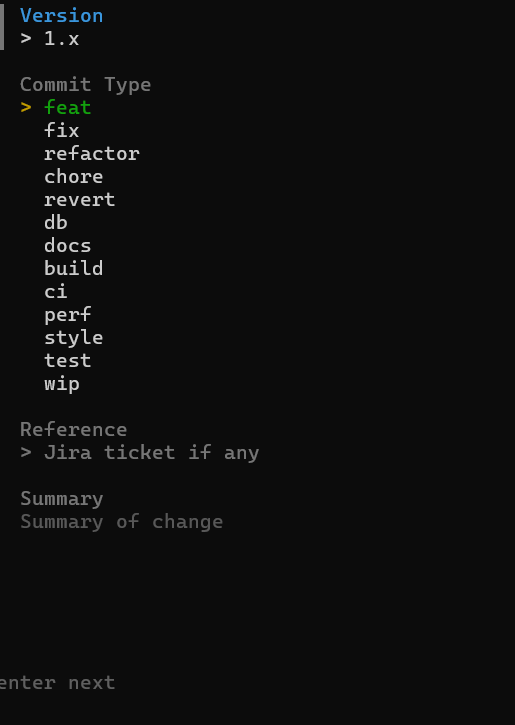

# Go Git Commit UI

This is a Go application designed to streamline the process of committing changes to a Git repository by providing a user-friendly interface for creating commit messages in a specific format. This application uses the huh terminal ui library to render a terminal-based form to capture user input for commit details (https://github.com/charmbracelet/huh).

## Features

- **Git Initialisation:** Checks if the current directory is a Git repository and prompts to initialise if not.
- **File Status Checking:** Identifies changed and staged files, allowing users to decide whether to stage or commit changes.
- **Commit Message UI:** Provides a terminal-based form to input commit details such as version, commit type, Jira reference, and summary.
- **Customizable Commit Format:** Supports a predefined format for commit messages, ensuring consistency across commits.
- **Branch Push Option:** Offers an option to push the current branch to the remote repository after committing.

## Configuration

The application uses a configuration file `config.json` to define default settings such as the commit message format and default values for version, commit type, and Jira reference.

Example `config.json`:
```json
{
    "git_commit_format": "[$version][$type][$jira]: $summary",
    "default_version": "1.x",
    "default_commit_type": "feat",
    "default_jira_reference": "SS-01"
}
```
If the configuration file is not found, one will be created with default values. Configure values before running the application.

## Usage

1. **Run the Application:** Execute the main Go application to start the commit process.
2. **Follow Prompts:** The application will guide you through checking file statuses, staging changes, and entering commit message details.
3. **Commit and Push:** After entering the commit message, confirm to commit the changes and optionally push them to the origin.

## Dependencies

- Go 1.23 or later
- Git must be installed and accessible from the command line.

## Installation

Clone the repository and navigate to its directory. Then build the application using:

```bash
go build -o git-commit-ui
```

Run the application with:

```bash
./git-commit-ui
```

## Screenshots




## License

This project is open-source and available under the [MIT License](LICENSE).
